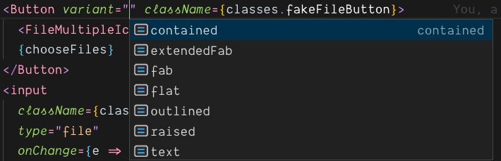

# Component Library

## Purpose:

- Pre-agreed that both designers and developers use Component Library.
- No Designer/Developer should spend the time creating their own "Button".
  - More time for Developer/Designer to spend on more important/difficult tasks.
- One source of truth for uniformity sitewide.
- Better/easier experience as a Developer/Designer
- Open source - everyone should be a contributer to Component Library.

## The Problem:

- No one really seems to be using it...
  - those who are, use it reluctantly
  - those who aren't, are spending time making their own "Button".
- Multiple versions across the site, and thanks to global css, other versions from other teams override your version.
  - the solution most Developers are taking to this... don't use Component Library.
- Very difficult to use:
  - Components are not well documented
  - Layout makes it hard to find if CL has component or updated component.
  - most of the time what is documented, isn't what is really in CL.
  - many developers opt out of using CL because "I can do it faster myself".
- Codebase is unnecessarily over complex

  - so many scripts that do nonsense
  - poor naming conventions
  - poor file/folder structure
  - work has to be coded (<= is that a word?) twice
    - once for CL and once for docs
  - poor documentation on how to work dev server or contribute.
  - not properly maintained and kept up to date (using webpack v2 and babel v6 with preset es2015).
  - for some reason currently using Rollup???, (which isn't even to v1 yet....)
  - most components destruct from props then spread all props afterward.
    - this means that the Dev can only replace and override CL and does not have ability to extend **ONLY IF NEEDED**.

  ```javascript
  const Component = props => {
    const { weight } = props;

    return <component className='myClass' weight={weight} {...props} />;
  };
  ```

## The Goal/Solution:

- CL should be so intuitive and so well documented that a Developer would have a harder time "doing it themselves".
  - Documentation should clearly show available options, as well as how they work and the required props to use them.
  - moving do a different css system so you no longer have to import styles separately.
  - give Developers the abilty to "extend" CL **ONLY IF NEEDED**.
    - this is necessary in the **RARE** case the styles are off because of parent styling or browser styling or some other **RARE** case that the developer needs to change something.
      This is to remove the "I'll just build it myself" mentallity.
  - Change imports to be more intuitive
    - should be
    ```javascript
    import Button from 'componentLibrary/Button';
    ```
    - not
    ```javascript
    import Button from 'componentLibrary/lib/buttons/Button';
    ```
- Start moving to CSS-modules, so css versioning won't have an affect across different teams.
- Simplify Code Base.

  - Anyone should have the ability to contribute to CL.
  - Developer Experience should be enjoyable and learning curve should be low.
  - Increase documentation so other devs can get up and running fast and contribute more to CL.
    - This means higher quality and quantity of components available from CL.
    - A true design system, that people can understand and have a greater abilty to use, because we all built it as a community/business/**team**
  - Explore moving to TypeScript

    - Better editor tooling
    - type system that is made for catching errors faster.
    - explicitly define props to make components much easier to use.
      

  - "Busy is the new stupid"
    - Complex _busy_ code, **does not** mean better.
